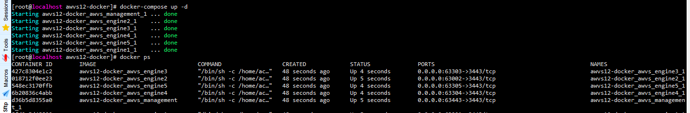
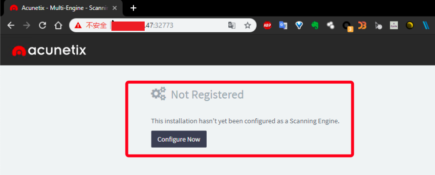
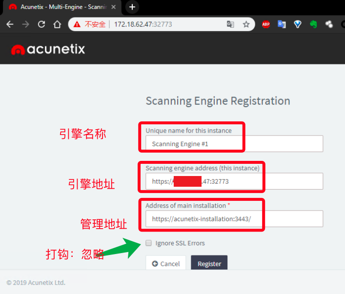
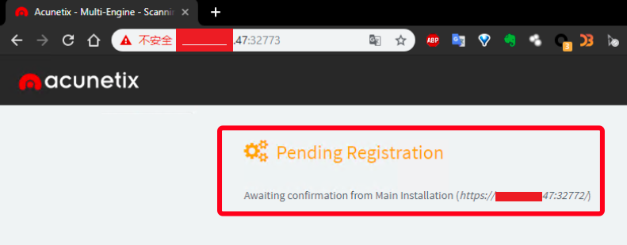
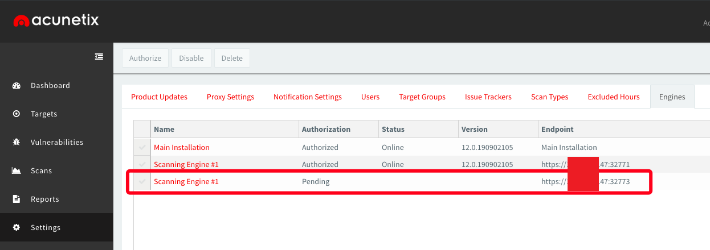
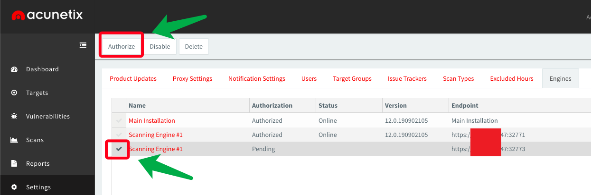
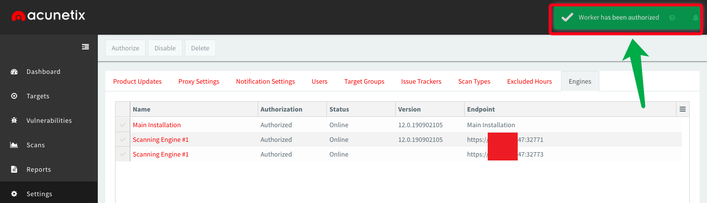
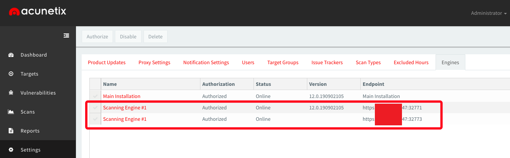

# 0x00 awvs 统一面板管理


**[How to install Acunetix Multi-engine](https://www.acunetix.com/blog/docs/install-acunetix-multi-engine/)**

2017年官方网站已经更新了安装多引擎的方法，直到今天自己才折腾一番，记录一下。


 猪猪侠的链接[http://t.cn/AimEyPIE](http://t.cn/AimEyPIE)，版本号AWVS 12.0.190902105_x64（2019年9月2日最新版本） 


# 0x01 awvs12 Multi-engine Docker

awvs12统一面板管理多引擎Multi-engine，一键docker部署，自动化扫描采用的方式为最新版"acunetix_12.0.190902105_x64"进行安全部署.


## 1. 部署安装

* Docker-compose

```json
1. 直接编译后运行

docker-compose up -d

2.先编译，后运行

docker-compose build
docker-compose up -d
```




## 2. 配置Multi-engine

### # 注册配置Agent

* 访问agent页面，如下



* 配置management端地址



* 发送注册请求，等待management确认



### # 配置awvs_management



* 确认添加








## 3. 可能的问题

### # management页面注册认证失败

进入manage docker中，执行如下命令：

```json
touch /home/acunetix/.acunetix/data/license/wa_data.dat
```

### # 一件配置部署

暂无脚本意见完成所有agent注册以及management面板的确认等问题，后续优化。
